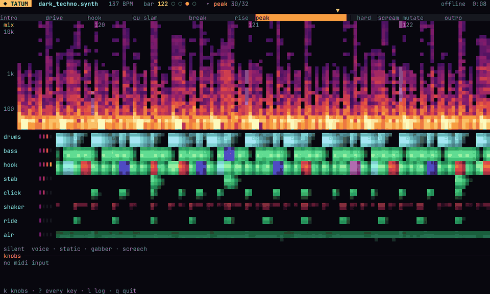

<h1 align="center">tatum</h1>

<p align="center">
  <b>Music as text. Write a song like code, hear every save on the next bar, play it live.</b>
</p>

<p align="center">
  <a href="https://github.com/sebasusnik/tatum/actions/workflows/ci.yml"></a>
  
  
  
</p>

<!--
  VIDEO PLACEHOLDER
  GitHub plays an MP4 in a README only when it is uploaded through the web editor:
  edit this file on github.com, drag the video onto this spot, and GitHub writes a
  https://github.com/user-attachments/assets/... link that renders as a player.
  Until then the GIF below stands in: thirteen seconds of the live screen, taken with
  `tatum tui-shot --frames` (see docs/TUI.md), with no sound.
-->

<p align="center">
  
</p>

A track in a DAW lives in a project file nobody can read. In tatum a song is a page of
text: the instruments, the patterns, the scenes and the order they come in, in a
`.synth` file you can read top to bottom, diff, review and keep in git.

Write it in your editor and leave `tatum watch` running beside it. Every save plays on
the next bar: a changed value at once, a new pattern or a new instrument handed over
with every tail still ringing. A save that does not compile is reported with its line
and a suggestion, and the last good version keeps playing, so the music never stops
while you think.

When it is ready to leave the editor, it goes on stage. A set is a folder of steps,
each the whole rig at a moment. A pad moves to the next one on the next phrase, the
knobs of a MIDI controller ride the parameters, and the live screen shows what every
track is doing. When something sounds wrong, `tatum debug` pulls the mix apart, part by
part, to find where.

## Why "tatum"

A **tatum** is the smallest regular pulse a listener hears in a piece of music: the
finest grid its notes fall on. The word was coined by Jeff Bilmes in 1993, from
*temporal atom*, in honour of the jazz pianist **Art Tatum**, whose runs were so fast
and so even that they seemed to divide time finer than anyone else.

That grid is where this project lives. A tatum pattern is a row of steps, sixteen to a
bar of 4/4, and every note, every hit, every slide and every parameter lock lands on
one of them. The engine counts in tatums, swing bends them, and the live session waits
for the next bar line, a multiple of them, to swap in what you saved.

## What is in it

- **A language that checks your music the way a compiler checks code.** Errors carry
  their line and a suggestion; design warnings catch what compiles but will not sound
  the way it reads, such as a breakdown louder than its drop.
- **A synthesizer in Rust, `no_std` and with no dependencies.** Four Volca-style
  instruments (acid bass, 4-op FM, poly keys, drum machine) plus instruments built from
  nodes, a 16-step sequencer with swing, ties, slides, an arpeggiator and parameter
  locks, insert and send effects, and every song leaving at the same loudness.
- **Live coding.** `watch` hot-swaps each save on the next bar; patterns transform
  TidalCycles-style (`rev`, `fast 2`, `every 4 rev`, `degrade 30%`) from the text or
  from a key.
- **Live sets and a controller.** A set is a folder of steps, played with tempo ramps
  and DJ-style blends; a `midi` block maps knobs, keys and pads to the song.
- **Tools that listen.** `render` reports the mix section by section, `debug` renders
  every part apart with spectrograms and finds clicks and mud, `audit` measures every
  note for what is not its harmonics.
- **Everywhere.** A CLI, the browser through WASM, and an MCP server so an AI can write
  songs with the compiler in the loop.

## A song

Two instruments, two patterns, two tracks and two scenes: an acid line over a kick,
the filter opening as the drop goes on.

```
tempo 126
scale A minor
sidechain 0.4

module beats kit { kick_level 1.0 }
module bass acid {
    cutoff 400hz
    resonance 80%
    glide 0.18
}

pattern beat {
    kick:  X - - -  X - - -  X - - -  X - - -
    hat:   - - x -  - - x -  - - x -  - - x -
}
pattern line {
    1.2  ~1.2  -  1.2   ~5.2  -  ~7.1  -
    1.2  -     -  ~3.2  ~1.2  -  5.1   ~1.2
}

track drums { play beat using kit out > master }
track acid  { play line using acid level 0.6 delay_send 0.2 out > saturate(0.4) > master }

scene intro { track drums { play beat using kit } }
scene drop {
    auto acid cutoff 0.2 > 0.6
    track drums { play beat using kit }
    track acid  { play line using acid }
}
arrange { intro x4  drop x8 }
```

## Getting started

You need Rust (stable). On Linux, audio output needs ALSA headers
(`sudo apt install libasound2-dev`); the WASM build needs the `wasm32-unknown-unknown`
target and, for a browser bundle, `wasm-pack`.

```
cargo run -p tatum-cli -- check examples/acid_arp.synth
cargo run -p tatum-cli -- render examples/acid_arp.synth -o acid_arp.wav
cargo run -p tatum-cli -- params bass
cargo run --release -p tatum-cli -- play examples/acid_arp.synth
cargo run --release -p tatum-cli -- watch live.synth     # re-evaluates on every save
cargo run --release -p tatum-cli -- watch live.synth --tui   # the same, full screen
cargo run --release -p tatum-cli -- debug examples/acid_arp.synth --solo acid
```

## What the CLI does

| command | what it does |
|---------|--------------|
| `check` | compile a song and report errors and design warnings, without sound |
| `render` | render a song to a WAV, with a report of the mix |
| `play`, `watch` | play a song live; `watch` swaps in each save on the next bar, and a save that does not compile is reported while the last good version keeps playing |
| `debug` | render every part apart, with spectrograms and a report of clicks and mud, bar by bar |
| `audit` | measure every note of every tonal track for what is not its harmonics |
| `set` | render, check, gate and play a live set |
| `tui-shot` | a picture of the live screen at any second |
| `params`, `fmt` | the parameter reference; knob positions rewritten in their units |

`play`, `watch` and `set play` read MIDI: a `midi` block puts the song on a controller,
knobs and faders on its parameters (`cc 74 > acid cutoff`), the keys on a track, the
pads on drums. Every flag is in [docs/CLI.md](docs/CLI.md).

### The live screen


`--tui` runs `play`, `watch` and `set play` full screen, for half a terminal with the
editor in the other half: the bar and the scene, the arrangement or the set's steps, the
mix as a scrolling spectrogram, a lane per track, the chosen track's pattern, the knobs
as they turn, and a save that did not compile, in red, until one does. Its keys mute,
solo and transform the tracks, writing the words into the file (`rev`, `fast 2`,
`every 4 rev`), and put knobs on them. See [docs/TUI.md](docs/TUI.md).

### Finding a noise


`tatum debug` renders once with every part kept apart and stacks them on one time axis
over the mix, with the sections on top, the clicks marked and a strip where three or
more parts pile up on the same range.

## Where to go next

- [`docs/DSL.md`](docs/DSL.md): the language reference.
- [`docs/CLI.md`](docs/CLI.md): every command and its flags.
- [`docs/TUI.md`](docs/TUI.md): the live screen, its keys, and pictures of it.
- [`docs/MIX.md`](docs/MIX.md): how to read what `render` and `audit` report.
- [`docs/HARDWARE.md`](docs/HARDWARE.md): what a song asks of a machine, and which Raspberry Pi or microcontroller can play it.
- [`docs/PARAMS.md`](docs/PARAMS.md): every module parameter (generated by `tatum params`).
- [`docs/MCP.md`](docs/MCP.md): the MCP server that lets Claude write songs with the compiler in the loop.
- [`docs/design/live-engine.md`](docs/design/live-engine.md): what it takes to play the engine live, measured; the design of the live session.
- `examples/`: songs across genres; each one compiles and renders.
- `examples/rigs/`: rigs, not songs — a full instrument with every optional voice at
  `level 0` and every effect at `wet=0`, waiting to be faded in. A set is built on one.
- Editors: syntax highlighting for Zed in
  [zed-tatum](https://github.com/sebasusnik/zed-tatum), on the tree-sitter grammar in
  [tree-sitter-tatum](https://github.com/sebasusnik/tree-sitter-tatum).
- `sets/`: live sets. A directory of numbered `.synth` files, each the whole rig at a
  moment, walked the way it is played (hot swaps, blends, tempo ramps) by `tatum set render` and played live by
  `tatum set play`, a key or a pad moving to the next step on the next phrase.

Workspace: `core` (engine, DSL, registry), `cli`, `debug` (the analysis behind `tatum
debug`), `mcp`, `wasm` (browser bindings; `wasm/examples/worklet/` runs them in an
AudioWorklet).

## License

Licensed under either of [Apache License, Version 2.0](LICENSE-APACHE) or
[MIT license](LICENSE-MIT) at your option. Unless you explicitly state otherwise, any
contribution you submit for inclusion in this project, as defined in the Apache-2.0
license, shall be dual licensed as above, without any additional terms or conditions.
