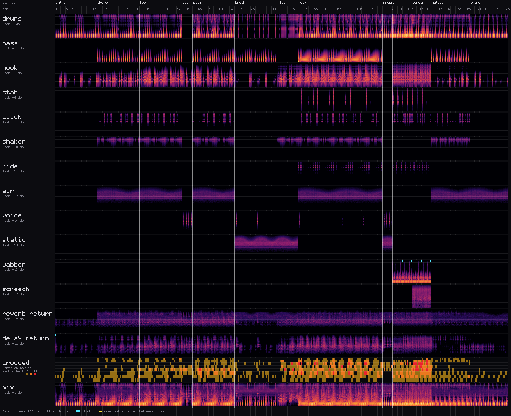

# The command line

`tatum <command>`; `tatum help` prints the short version of this page. With cargo,
`cargo run --release -p tatum-cli -- <command>`.

| command | what it does |
|---------|--------------|
| [`check`](#check) | compile a song and report errors and design warnings, without sound |
| [`render`](#render) | render a song to a WAV, with a report of the mix |
| [`play`](#play-and-watch) | play a song on the audio device |
| [`watch`](#play-and-watch) | play it, and play every save of the file on the next bar |
| [`debug`](#debug) | render every part apart, with spectrograms and a report of clicks and mud |
| [`audit`](#audit) | measure every note of every tonal track for what is not its harmonics |
| [`set`](#set) | render, check, gate and play a live set |
| [`tui-shot`](#tui-shot) | a picture of the live screen at any second |
| [`params`](#params) | every module parameter, its range and units |
| [`fmt`](#fmt) | rewrite knob positions in their units |

Every command that reads a song resolves its `use "..."` lines first, so a song
built on a rig compiles as one file.

## check

```
tatum check song.synth
```

Parses and compiles, and prints what is wrong with the line it is on and a suggestion.
Then the design warnings: things that compile and will not sound the way they read,
like a track ducked by a sidechain in a scene with no kick. They are listed in
[DSL.md](DSL.md#design-warnings). It exits 1 on an error, 0 with warnings.

## render

```
tatum render song.synth [-o out.wav] [--bars N] [--solo a,b] [--mute c]
```

Renders the whole arrangement to a WAV (`output.wav` by default; `--bars N` renders
only the first N bars).
Every song leaves at -18 LUFS with its true peak limited at -1 dB, after the master
chain. On the way it prints the mix: each track's peak, RMS, crest, width and band, the
tracks that share a band at a similar level, each section's loudness against the
loudest, and what the master chain did to the peaks. At the end it lists what it heard
that sounds wrong: clicks, tracks that do not go quiet between notes. How to read that
report is in [MIX.md](MIX.md#reading-a-mix).

## play and watch

```
tatum play  song.synth [--tui] [--device <name>] [--rate <hz>] [--midi <name>] [--buffer <frames>]
tatum watch song.synth [--tui] [--device <name>] [--rate <hz>] [--midi <name>] [--buffer <frames>]
tatum midi monitor [<song.synth> | <set dir> [--step N]] [--midi <name>]
tatum midi list
```

`play` plays the song on the default output device until it ends or you type `q`.
`watch` does the same and plays every save of the file. A value edit applies at once.
Anything else takes over on the next bar, keeping every tail and voice the edit did not
touch, and a save that does not compile is reported while the last good version keeps
playing. A song without `scene` and `arrange` loops: that is a live set in one file.
See "Livecoding semantics" in [DSL.md](DSL.md#livecoding-semantics).

- `--device <name>` picks the output device; `--list-devices` lists them.
- The engine renders at 44.1 kHz. A device that only offers another rate, as every
  Bluetooth headphone does at 48 kHz, gets the output resampled; `--rate` forces one.
- A MIDI controller plays the song through its `midi { }` block: knobs and faders on
  parameters, the keys on a track, the pads on drums. Every MIDI input is read unless
  `--midi` names one; `--list-midi` lists them. See [DSL.md](DSL.md#midi-knobs-keys-and-pads).
- `--tui` runs full screen; `--glass` is the same for a terminal with translucent cells.
  See [TUI.md](TUI.md).
- `--buffer 1024` asks the device for that many frames a callback, for headroom when
  its default leaves too little.
- `tatum midi monitor` prints every message a controller sends (notes, pads, knobs, the
  pitch strip, aftertouch, program changes) with its channel and bytes, and, given a
  song or a set, what its `midi` block, zones and trigger keys do with it: the way to
  find out what a controller really sends before mapping it. `i` on the live screen
  shows the same.

On exit both print the worst audio callback time against its budget, and how many
dropouts the device reported.

## debug

```
tatum debug song.synth [--bars N | A-B] [--dry] [-o dir] [--solo a,b] [--mute c]
```

For finding where a noise comes from. It renders once with every track, bus and send
return kept apart, each as it sits in the mix, and writes into
`test_output/debug/<song>/` (or `-o`):

- a WAV and a spectrogram per part;
- `sheet.png`, all of them stacked on one time axis over the mix, with a "crowded"
  strip where three or more parts pile up on the same range;
- `report.txt`: clicks (and which fall on a section change), tracks that do not go
  quiet between notes, energy below 25 Hz and fizz above 16 kHz, each with its bar,
  and per section each part's level against the loudest and which parts sit level
  with each other on top of the same range;
- `zoom.*.png`, the worst moment of each part up close, its wave and its spectrum.

`--bars 17-24` zooms in on those bars; `--dry` adds each track before its insert chain.



## audit

```
tatum audit song.synth [--bars N] [--json] [--strict]
```

Renders every tonal track on its own and dry, and reports per note how much of its
energy is not at a harmonic of the note the pattern asked for. That finds two things:
a note going wrong against the other notes of the same voice, and an effect dirtying a
whole voice, by rendering it with and without each effect. The absolute number is a
fingerprint of a timbre and means nothing next to another track's. `--json` prints the
same numbers for a script; `--strict` exits 1 if anything is reported. More in
[MIX.md](MIX.md#auditing-a-mix).

## set

A set is a directory of numbered `.synth` files, each the whole rig at a moment,
walked in filename order. A step's header says how long it holds and what it is:
`# set: bars=32 phase=build energy=5`; every step is a song in the language of
[DSL.md](DSL.md), usually a rig (`use "_rig.synth"`) and what changes.

```
tatum set check  <dir> [--bars N] [--json]
tatum set render <dir> [-o set.wav] [--bars N] [--phrase 1] [--ramp 4] [--blend 0] [--perform script.txt]
tatum set next   <dir> <candidate.synth> [--json] [--max-voices N]
tatum set play   <dir> [--tui] [--auto] [--phrase 8] [--ramp 4] [--blend 0] [--device <name>] [--midi <name>] [--buffer <frames>]
tatum set controls <dir> [--step N] [--bars 2]
```

- **`check`** validates every step and reports the set's arc.
- **`render`** walks the set the way it would be played, with real hot swaps, tempo
  ramps and blends, into one continuous WAV, and prints where each step starts.
  `--perform` plays a script of knobs, pads, keys and step moves on top, for review
  audio without the hardware.
- **`controls`** tries every control of every step the way a hand would -- each knob
  on each page turned end to end, each pad and trigger key held, the strip and the
  wheel thrown, with the key or pad a voice needs held when it needs one -- and prints
  per step the ones that changed nothing (`NOTHING`) and how much the others did.
- **`next`** is the gate a proposed step has to pass against the last one: it says yes
  or no and why. It is meant for an agent writing a set step by step.
- **`play`** plays it live. The space bar, a key or a pad asks for the next step, which
  lands on the next phrase line (`--phrase`, 8 bars by default). `--auto` lets the set
  walk itself by its headers, `--ramp` is how many bars a tempo change takes, `--blend`
  mixes two steps the way a DJ does. `--tui` runs full screen, with the steps and their
  cues ([TUI.md](TUI.md)).

### Playing a set live

A set is a directory of numbered `.synth` files, each the whole rig at one moment
(`sets/` has five). `tatum set play <dir>` plays it with a controller in hand:

```
tatum set play sets/mine --phrase 8 --ramp 4
```

It starts on the first step. The space bar (or `n`, or →) asks for the next one, ←
for the one before, a digit for a step by number, and a pad can do the same with
`pad 48 > next`, `prev` or `step 3`; a song's `keyboard { }` block binds the
computer's keys to its performance scenes and to these moves (see "Zones, scenes and
the computer's keys" in [DSL.md](DSL.md)). A step's header can bring a scene in as it
lands: `# set: perform=drop`. What was asked for does not come in at once: it
lands on the next phrase line, the next bar that is a multiple of `--phrase` (8 by
default), so the set keeps its phrasing whoever is at the controls. The status line
counts down the bars to it. Asking for the step that plays cancels the move.

A step that needs a new engine is built in the last bar of the phrase and handed over
on the line, the way a save is: what the two steps share keeps playing and what leaves
rings out. A step that only changes values is sent on the line itself. A step at another
tempo starts at the tempo that was playing and ramps to its own over `--ramp` bars (4
by default; 0 jumps). Knobs, toggled tracks and held pads carry from step to step.

`--blend 8` mixes instead of handing over, the way a DJ does: the step that was playing
keeps going under the new one for 8 bars while it fades out and the new one fades in,
the two on the same tempo through the ramp, and the low end changes hands at the
midpoint in 50 ms so two basses never play at once. A step can ask for its own with
`# set: blend=8` in its header. It is for going between steps that have little in
common; steps built on one rig hand over well on the line.

`--auto` lets the set walk itself, the way `set render` does: each step holds the bars
its header gives and asks for the next in its last bar, so the hands are free for the
music. The phrase becomes 1 bar unless `--phrase` says otherwise, because a step's bars
need not be a multiple of 8. A key or a pad still moves the set at any time.

A step can carry its own practice sheet. `# cue: <bar> <what>` lines, with the bar of
the step counted from 1 and a fraction for the beat (`8.75` is bar 8, beat 4), show
under the steps in `set play --tui`: the bar of the step and its beat, the cue whose
bar is playing, and the next one counting down.

```
# set: bars=24 phase=08-amoladora energy=8
# cue: 17 B1 held + K3 from 0 to the top · the grinder: idle, scream, cut
# cue: 20.75 let go of B1
```

The file of the step playing is watched like `tatum watch` watches one: save it and the
edit plays. `q` or Ctrl-C quits and leaves the terminal as it was.

A step builds tension with `auto ... over N` (see "Lanes in a song without scenes" in [DSL.md](DSL.md#lanes-in-a-song-without-scenes)):
its lanes start on the step's first bar, whenever the step lands, and hold once done.

`tatum set render <dir> -o set.wav` walks the set the same way with nobody at the
controls: each step is asked for a bar before its header's `bars` run out, so it lands
there, the tempo ramps (`--ramp 4`), `blend=` in a header blends (`--blend` sets it for
every step), and the render is the set as it would be played. `--phrase 8` lands steps
on phrase lines as `play` does, moving a step whose predecessor ends off the line to
the next one; the default, 1, keeps every step to its header. It prints where each
step starts, `m:ss  name  bars  phase  note`, one line per step.

`--perform script.txt` plays a performance on top, for review audio without the
hardware. The script is one event a line, `<bar> <what>`, the bar counted from 0 at the
set's first downbeat and fractional:

```
# hiperespacio, one take
12.0   cc 74 64        # a knob or fader to 64
18.0   pad 44 110      # a pad down, struck at 110
19.0   pad 44 0        # and up
20.5   key 48 100      # a key down (velocity 0 lets it go)
21.0   bend 12000      # the pitch strip, 0..16383, 8192 at rest
35.0   next            # ask for the next step; also `prev`, `step 3`
40.0   perform drop    # a scene, as its computer key would call it
41.0   press pad 40 90 # aftertouch on a held pad (or `press key 45 90`)
42.0   voice bass      # the knobs' page (also `voice next`, `voice prev`)
96.0   end             # stop here
```

The events go through the same planner the live session uses, against the `midi`
blocks of the step playing: knobs, toggles and held pads carry from step to step as in
`set play`, and a pad mapped to `next` moves the set. An event lands on the sample its
bar falls on, to within a block (3 ms). A script that moves through the set (`next`,
`prev`, `step`, or a pad mapped to one) is the only thing that does, and a move lands
on the next phrase line as it would live; one that does not leaves the steps to their
headers. Without `end`, a scripted walk stops when the last step reached has played its
header's bars and every event has happened. The render prints what the script did
under the step markers, in the script's bars, from 0: `bar 12.00: acid cutoff 1.2khz`,
`bar 35.00: asked for 4/12 04.synth, lands on bar 36`, `bar 36: now 4/12 04.synth`.
(`set play`'s status line counts bars from 1, as a performer does.)

## tui-shot

```
tatum tui-shot <song.synth | set dir> [--step N] [--at <seconds>] [--size 160x48] [--font f.ttf] [--frames N] [-o shot.png]
```

A PNG of the `--tui` screen at a moment of a song or a set's step, without a terminal
or an audio device. Every picture in [TUI.md](TUI.md) was taken with it; its other
flags are there too.

## params

```
tatum params [bass|fm|keys|beats|track|fx] [--json]
```

Every module parameter with its range, units, default and what it does, as markdown, or
JSON with `--json`. [PARAMS.md](PARAMS.md) is its output, checked in CI.

## fmt

```
tatum fmt --units song.synth
```

Rewrites every module parameter written as a knob position (`cutoff 0.1`) in its units
(`cutoff 800hz`), with as few decimals as read back to the same knob, so the song sounds
the same.

## Solo and mute

`render`, `play`, `watch` and `debug` take `--solo` and `--mute` with track names,
comma-separated or with the flag repeated. A muted track is taken to level 0
everywhere, level automation included. A muted kick still drives the sidechain, so
what is left pumps the way it does in the mix.
