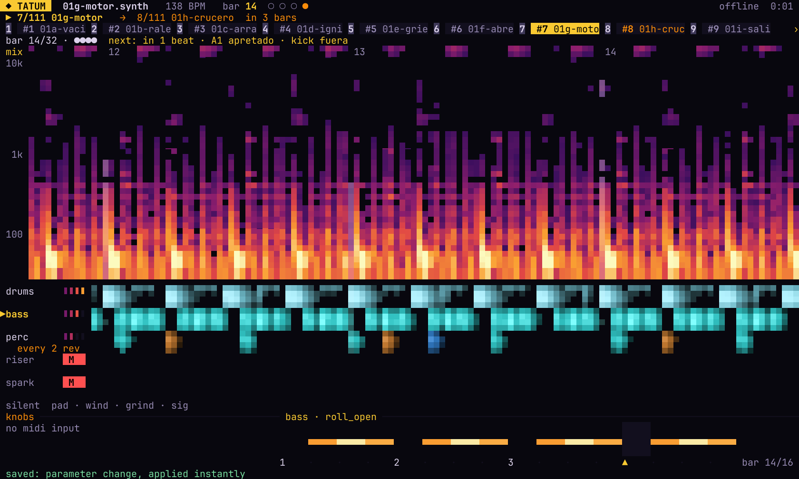
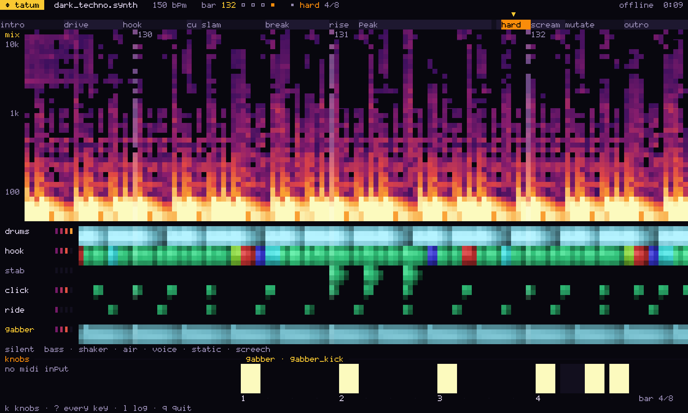
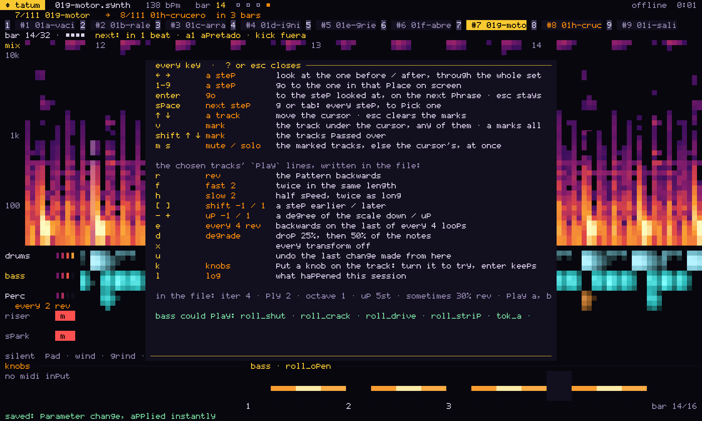
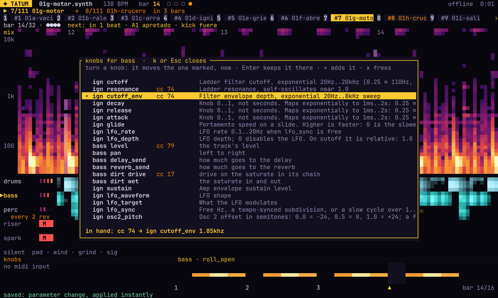
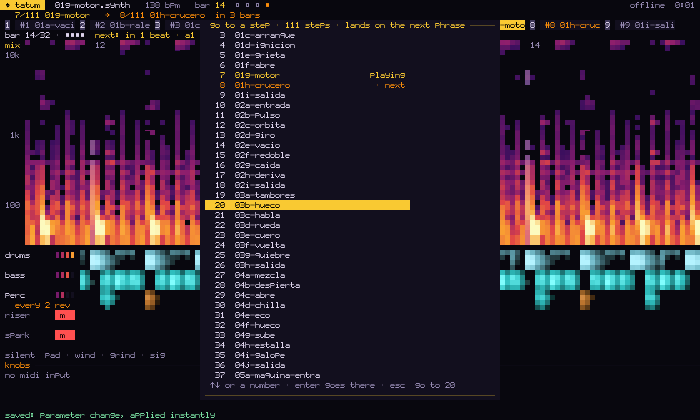

# The live screen



`tatum play`, `watch` and `set play` take `--tui` and run full screen, meant for half a
terminal with the editor in the other half:

```
tatum watch live.synth --tui
tatum set play sets/viaje --tui --midi keylab
```

## What it shows



Top to bottom:

- **The header:** the song or the step, the BPM, the bar with its beats lighting, and
  the scene with how far into it.
- **The arrangement** with a playhead, or the set's steps with the one queued flashing
  and the bars until it lands. A set gets a third row with the bar of the step and its
  next `# cue:` (see "Playing a set live" in [CLI.md](CLI.md#playing-a-set-live)).
- **The mix** as a scrolling spectrogram with bar lines and numbers. It uses
  `tatum debug`'s colours, log frequency and 100 Hz / 1 kHz / 10 kHz lines, so the
  screen and the pictures read the same.
- **A lane per track that is playing,** its five bands scrolling with it. A tonal track
  is coloured by the note it plays, a drum track in one colour, and the tracks that are
  loaded and silent are named on one line under them.
- **The knobs** as they turn, in units. Beside them is the chosen track's pattern, one
  bar of it as it plays this loop, transformed when the loop is, with the step lit. A
  save that does not compile shows here instead, in red with its line numbers, until
  one does.
- **The last line** shows the session's newest word for a few seconds, then the keys.

## Keys

`?` lists every key on the screen itself:



In short:

| key | what it does |
|-----|--------------|
| `↑` `↓` | choose a track; `v` marks it, `Shift+↑↓` marks as it moves, `a` marks every lane, `Esc` clears |
| `m` `s` | mute / solo the marked tracks, else the chosen one, at once |
| `r` `f` `h` | write `rev`, `fast 2`, `slow 2` on their `play` line |
| `[` `]` `-` `+` | `shift -1 / 1`, `up -1 / 1` |
| `e` `d` | `every 4 rev`; `degrade` 25%, then 50% |
| `x` `u` | every transform off; undo the last change made from the screen |
| `k` | put a knob on the chosen track (see "Knobs and faders" in [DSL.md](DSL.md#knobs-and-faders)) |
| `l` | the session's log |
| `i` | MIDI in: every message the controller sends, and what the song does with it |
| `space` `n` `p` | in a set: the next step, the one before |
| `←` `→` `Enter` | in a set: look through the steps, go to the one looked at |
| `1`-`9` `g` `Tab` | in a set: go to a step on screen; pick from every step |
| `q` `Ctrl-C` | quit; `Esc` never quits |

`k` lists everything the chosen track offers a knob, with what each controller already
moves; turn a knob while it is open and it moves the one marked, to try it:



In a set, `g` or `Tab` lists every step, with the one playing and the one queued:



The transform keys write into the file, as if typed (see "Transforming a pattern" in [DSL.md](DSL.md#transforming-a-pattern)), so
the save plays and the change stays. `--glass` is `--tui` painted with cell backgrounds
only, for a terminal that makes them translucent (Ghostty: `background-opacity-cells`).

## A picture of the screen: `tui-shot`

`tatum tui-shot` takes a picture of the screen without a terminal or an audio device.
The song is rendered offline up to a moment and the screen fed on the audio's own
clock, so the PNG shows what the screen would show at that second:

```
tatum tui-shot examples/dark_techno.synth --at 230 --size 120x40 -o shot.png
tatum tui-shot sets/viaje --step 3 --at 20 --select sub -o step3.png
```

`--size` is in cells (160x48 by default). `--select <track>` chooses a track, so its
pattern shows, and `--mark`, `--mute` and `--solo` take track names. `--help`, `--log`,
`--knobs N` and `--pick N` open the overlays, and `--look N` looks at step N of a set.
`--font <file.ttf>` draws the text in a monospace TrueType font instead of the
pictures' own 5x7 one, sized to the cell, with its Bold face beside it when the
file's name says Regular. Every picture here uses JetBrains Mono Nerd Font.

`--frames N` takes N pictures from `--at` on, `--fps` a second (10 by default), in one
render, into the directory `-o` names (`frame-0000.png`, `frame-0001.png`...). That is
how the README's GIF was made:

```
tatum tui-shot examples/dark_techno.synth --at 213 --frames 130 --size 140x42 \
    --font ~/Library/Fonts/JetBrainsMonoNerdFont-Regular.ttf -o frames
ffmpeg -framerate 10 -i frames/frame-%04d.png -vf "fps=6,scale=960:-1:flags=lanczos,\
split[a][b];[a]palettegen=max_colors=64:stats_mode=diff[p];[b][p]paletteuse=dither=none" \
    -loop 0 tui.gif
```

`--see-through` paints a wallpaper behind the screen, to show what a translucent window
lets through, and `--glass` draws it as `--glass` does.
